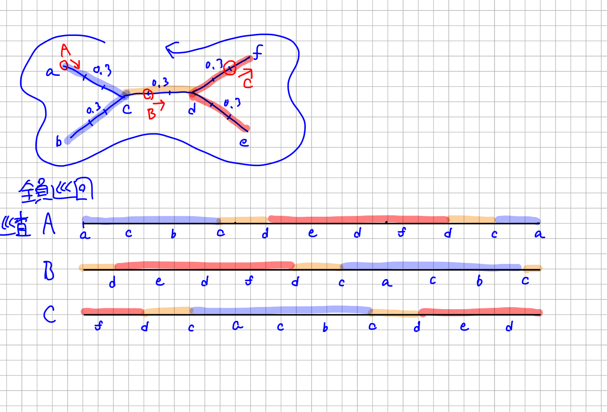

# Tree (memo)

## 既知の結論

* 巡査が1人
    * グラフが星・木のとき，全点の利得と訪問間隔が等しい場合は多項式時間で解ける
    * グラフが星・木のとき，利得か訪問間隔が一般の場合はNP困難
* 担当警邏問題
    * グラフが星・木のとき，全点の利得と訪問間隔が等しい場合でもNP困難
* （担当無し）警邏問題
    * グラフが星・木のとき，利得か訪問間隔が一般の場合は，巡査が1人の場合からNP困難
    * グラフが星で全点の利得と訪問間隔が等しい場合は多項式時間で解ける
    * グラフが木で全点の利得・訪問間隔が等しい場合は？

#### 2017/10/10
* 星2つの中心同士が1本の橋で結ばれた図形をまず考える．
* 【予想】左右独立運行 or 全員協力運行のいずれかが最適になる
* 簡単な場合から
    * 長い枝は省く（1人常駐が必要なのは示せそう）
    * 左右の星は同じ図形の場合
    * さらに枝の長さをすべて同じにする
* $m$人による全員協力運行で警邏可能であるとき，

$$
    2 \left(\sum_{e \in E} d(e) + b \right) \leq mQ
$$

where
    $Q$：訪問間隔，
    $m$：巡査の人数，
    $b$：橋の長さ，
    $E$：枝の集合．
（逆も成立）

* $m$人による左右独立運行で警邏可能であるとき，
    ある $k (0 < k < m)$ が存在し，

$$
    2 \sum_{e \in L} d(e) \leq kQ
    \textrm{ and }
    2 \sum_{e \in R} d(e) \leq (m - k)Q
$$

where
    $Q$：訪問間隔，
    $m$：巡査の人数，
    $b$：橋の長さ，
    $L$：左の星の枝の集合，
    $R$：右の星の枝の集合．
（逆も成立）

#### 2017/10/17
* 運行の帰着で示すのが難しそう（仮説の運行は複数人の動きを同時に決めているので）．
* 1度も橋を渡らない運行では左右独立運行が最適．
* 1度でも橋を渡る運行では全員協力運行より少ない人数では警邏できないことを示す？
* 訪問間隔 $Q$ ごとに橋往復の $2b$ のコストがかかることを示せればよい

#### 2017/10/18
* 左右それぞれの星は最小 $m_L$, $m_R$ 人で警邏できるとすると，あえて橋を渡るのは $m_L + m_R - 1$ 人以下にできる場合のみ．すると，少なくとも一方は警邏可能最小人数より1人以上少ない巡査で運行する時間が生まれる．この時間の上限はいくらか．
